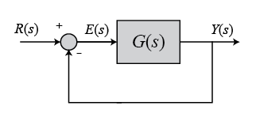
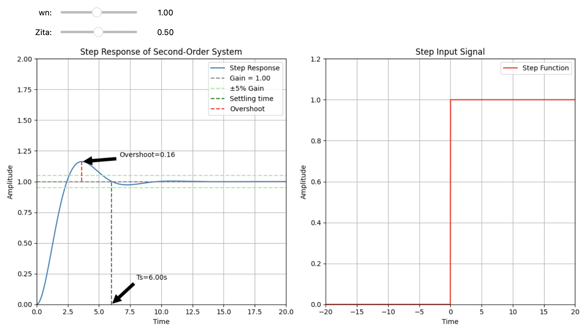
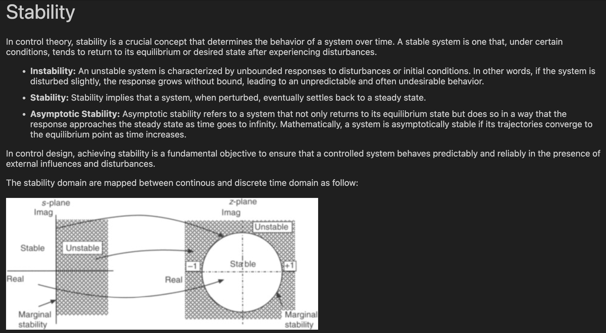

# Control Theory Repository

This is a free repository with the aim to create usefull interactive python scripts well commented and explained in order to better understand the topics of the Control Theory

 

## Rules

The aim is to create interactive python scripts via sliders or any other GUI that can be used in an interactive way to deeply understand the specific topic. 

Example GUI:
 

Any descriptions on the topic covered in the script can be added

Example description:
 

## Structure

The topics already studied correspond to their python script name. Here there is the list:

- bode.ipynb
- corrective-network.ipynb
- nichols.ipynb
- nyquist.ipynb
- PID.ipynb
- response.ipynb
- root-locus.ipynb
- stability.ipynb
- steady-state-error.ipynb

All the images needed are in the folder:

* images/

## Collaboration

Feel free to update the repository by improving the explainability of the existing scripts, or add new scripts that show a new topic.
